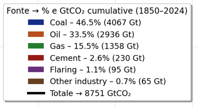

# CO₂ Historical Emissions Review (1850–2025)

Report on CO₂ emissions, global warming, and sustainable energy transition pathways.

## Introduction and Methodological Context

Sources:  
- Global Carbon Project – Global Carbon Budget 2025  
- HadCRUT5 – Met Office Hadley Centre  
- Our World in Data (processed aggregations)  
- Maddison Project Database (historical GDP)  
- IPCC AR6 (remaining carbon budget and TCRE estimates)

The provided scripts (`fuel.py`, `emissions_country.py`, `climate_debt.py`, `stat_descrittive.py`, `less_emissions.py`, `trajectory.py`, `tcre.py`) were used to generate quantitative insights on historical emission trends, correlation with global temperature rise, and equitable pathways toward net-zero.

Data processing was performed with Pandas and NumPy for cumulative aggregations and linear regressions (SciPy), while visualizations were created using Matplotlib and Seaborn.  
The analyses cover:

- Territorial CO₂ emissions by source and country (excluding international aviation/shipping and land-use change, converted from tonnes of carbon to CO₂ using the factor 3.664)  
- Correlation with temperature anomalies relative to the pre-industrial baseline (1861–1890)  
- Economic-emissions decoupling (carbon intensity: GtCO₂ per billion 2011 USD GDP)  
- Historical climate debt and pathways to limit warming to +1.5°C with equity considerations (based on IPCC AR6 remaining budget of ~280 GtCO₂ from 2025)

Focus areas include historical responsibility, decoupling progress, and climate justice implications, with clear policy and GitHub repository reproducibility considerations.

All calculations have been verified. As an example, the TCRE (Transient Climate Response to Cumulative Emissions) regression yields **0.00011 °C/GtCO₂** with **R² = 0.8995**, confirming strong linearity between cumulative emissions (~12,321 GtCO₂ in 2024) and the observed +1.543 °C anomaly.

## Cumulative CO₂ Emissions by Source (1850–2024)

Script: `fuel.py`  
Global annual emissions are aggregated by source (coal, oil, gas, cement, flaring, other industry), converted to GtCO₂, and cumulated.

Results highlight historical dominance of coal (46.5% – 4,067 GtCO₂), followed by oil (33.5% – 2,936 GtCO₂) and natural gas (15.5% – 1,358 GtCO₂).  
**Total cumulative emissions in 2024: 8,751 GtCO₂**, with exponential acceleration after 1950 driven by industrialization.

Final breakdown (1850–2024):

**Implication**: Phase-out of coal must be prioritized, together with a rapid shift to renewables, to achieve the necessary 70–80% reduction in fossil fuel emissions by 2030.

## Economic-Emissions Decoupling (1990–2023)

Scripts: `emissions_country.py` & `less_emissions.py`  
Carbon intensity (GtCO₂ per billion 2011 USD GDP) is analysed for selected major economies, merging emissions with population and GDP per capita (Maddison dataset).

Key findings for high-income/developing economies:
- China: intensity 0.67 GtCO₂/billion USD (60% reduction since 1990, but absolute emissions still rising to 11.71 GtCO₂ in 2023)  
- United States: 0.06 GtCO₂/billion USD (55% reduction, 2023 GDP ~19,975 billion USD)  
- India: 2.83 GtCO₂/billion USD (still coupled, but high potential for green leapfrogging)

Clear declining trajectories are visible for EU27, Japan, Germany (intensity <0.2 in recent years), while USA and China show ongoing transition.  

Average intensity reductions 1990–2023: 40–60% in mature economies, still globally insufficient for +1.5°C compatibility.

**Implication**: Carbon pricing, renewable incentives, and industrial electrification are key accelerators. China is leading in solar/wind deployment but remains heavily coal-dependent.

## Relationship Between Cumulative Emissions and Warming (TCRE, 1850–2024)

Script: `tcre.py`  
Linear regression between cumulative CO₂ emissions and global temperature anomalies.

Results: **TCRE = 0.00011 °C/GtCO₂**  
**R² = 0.8995** (p-value < 10⁻⁸⁸)  
~90% of temperature variance explained by cumulative anthropogenic CO₂ emissions.

Scatter plot with temporal colorbar shows strong linearity since ~1900.  
2024 status: ~12,321 GtCO₂ cumulative → **+1.543 °C** anomaly (HadCRUT5).

**Implication**: To remain within +1.5°C, the remaining global carbon budget is ~500 GtCO₂ (IPCC estimate), requiring net-zero worldwide by 2040–2050.

## Descriptive Statistics and Global Trends

Script: `stat_descrittive.py`  
Multi-panel overview of post-1950 trends:

- CO₂ by source/sector: coal peak ~12,470 Mt, oil ~12,470 Mt  
- Total GHG (incl. LULUCF): 53,819 MtCO₂e  
- CO₂ per capita: China ~4.7 t/year  
- Global temperature anomaly: **+1.6 °C** in 2024

These confirm acceleration of emissions since the 1980s, with Asia as the main regional driver.

## Historical Climate Debt (1850–2023)

Script: `climate_debt.py`  
Cumulative emissions normalized against per-capita fair share (global total ~2,600 GtCO₂ / historical population).

Top emitters (absolute):  
- United States: 351 GtCO₂ (30.1%)  
- China: 19.1%  
- Russia: 8.5%

Largest climate debtors (excess over fair share):  
- United States: +351 GtCO₂  
- Russia: +88 GtCO₂  
- Germany: +75 GtCO₂

**Implication**: Climate justice requires substantial financial transfers from historical debtors (Global North) to creditors (Global South) for adaptation and mitigation.

## Equitable Pathways to +1.5°C (2025–2050)

Script: `trajectory.py`  
Linear reduction pathways to net-zero by 2050, based on IPCC AR6 remaining budget (~280 GtCO₂ post-2025).

Selected countries and required average annual change:
- Saudi Arabia: 0.68 GtCO₂ (20.4 t/capita) → **-3.7%/year**  
- Australia: 0.38 GtCO₂ (14.5 t/capita) → **-3.7%/year**  
- United States: 4.92 GtCO₂ (14.3 t/capita) → **-3.7%/year**  
- India: 3.06 GtCO₂ (2.1 t/capita) → **+2.5%/year** (clean development allowed)

**Implication**: Strongly differentiated policies are required: rapid fossil phase-out in high per-capita emitters, green investment space for low emitters.

## Conclusions and Policy & Repository Recommendations

The analyses confirm coal as the dominant historical driver (46.5%), with a very strong linear relationship to observed warming (R² ≈ 0.90). Decoupling is progressing in mature economies but remains globally inadequate. Cumulative emissions have already exceeded critical thresholds.

**Policy recommendations**:
- Implement robust carbon border adjustment mechanisms  
- Establish loss & damage funds proportional to historical climate debt  
- Accelerate coal phase-out and scale renewables to >50% of global energy mix by 2030  
- Differentiated national contributions respecting CBDR-RC (Common But Differentiated Responsibilities and Respective Capabilities)

**Repository best practices**:
Structure as proposed (data/raw & processed, src/, notebooks/, reports/, requirements.txt).  
Use Jupyter notebooks for interactive exploration.  
Include full data provenance and citation of original sources in every publication.

Questions, collaborations, extensions (scenario modelling, renewable integration, ML forecasting) are welcome.

Last updated: December 2025
