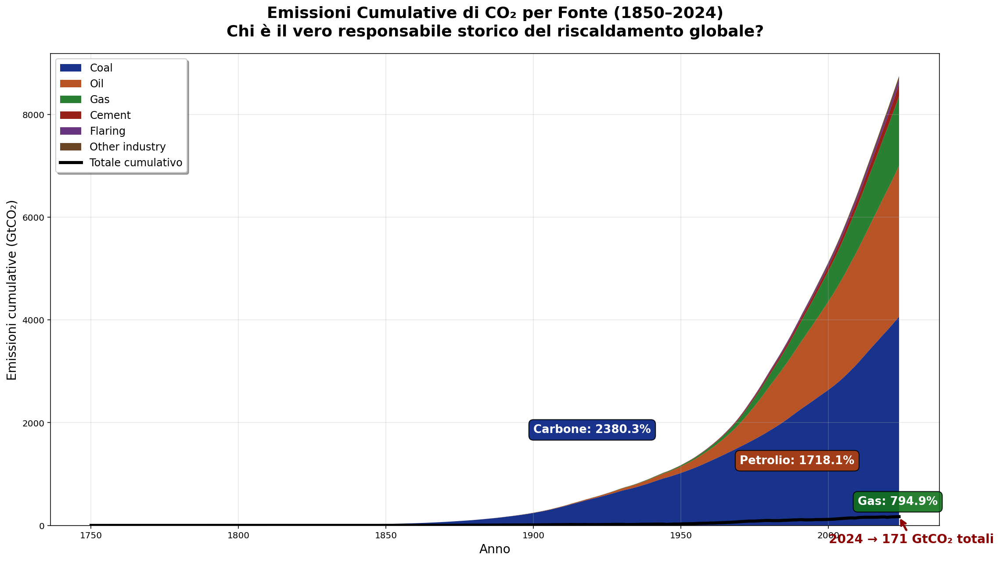
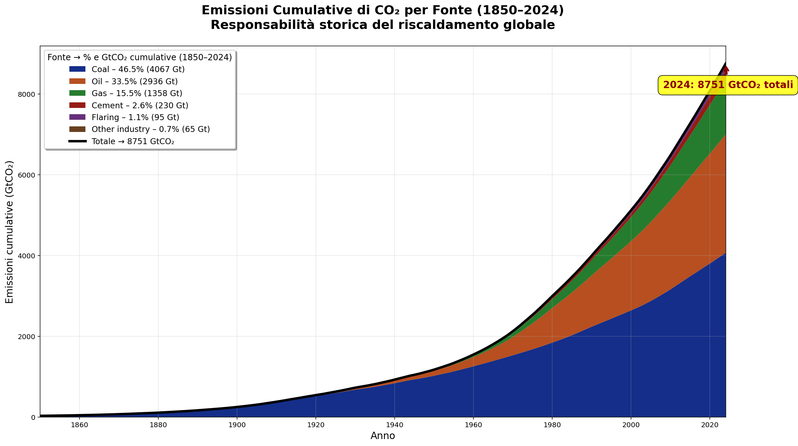
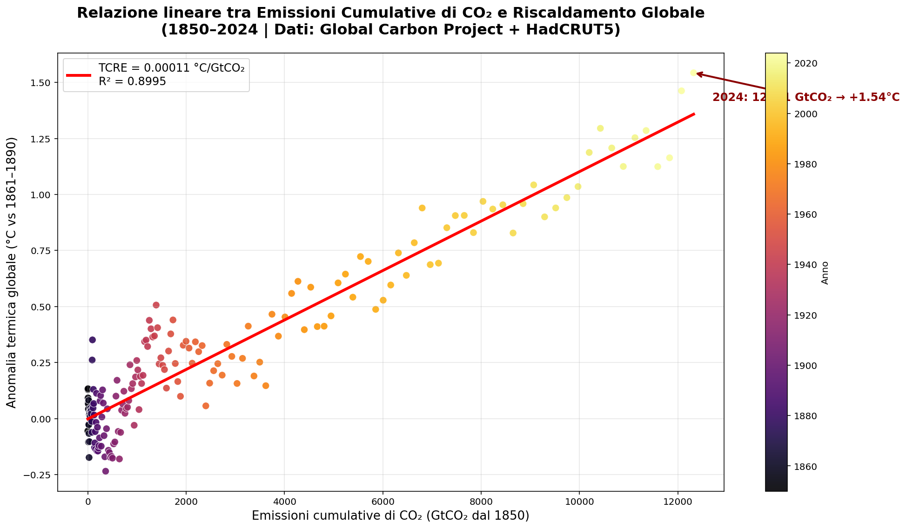
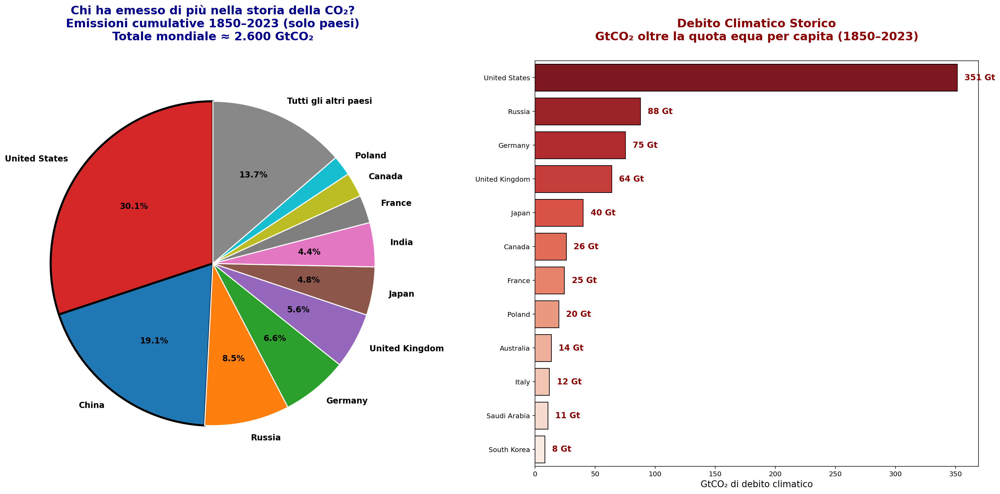
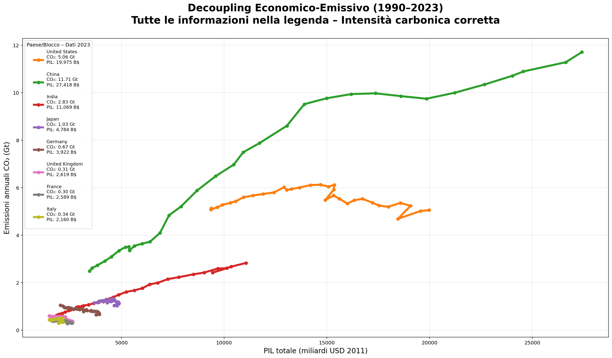
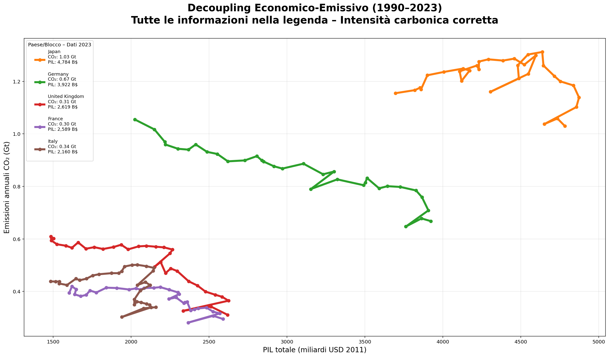
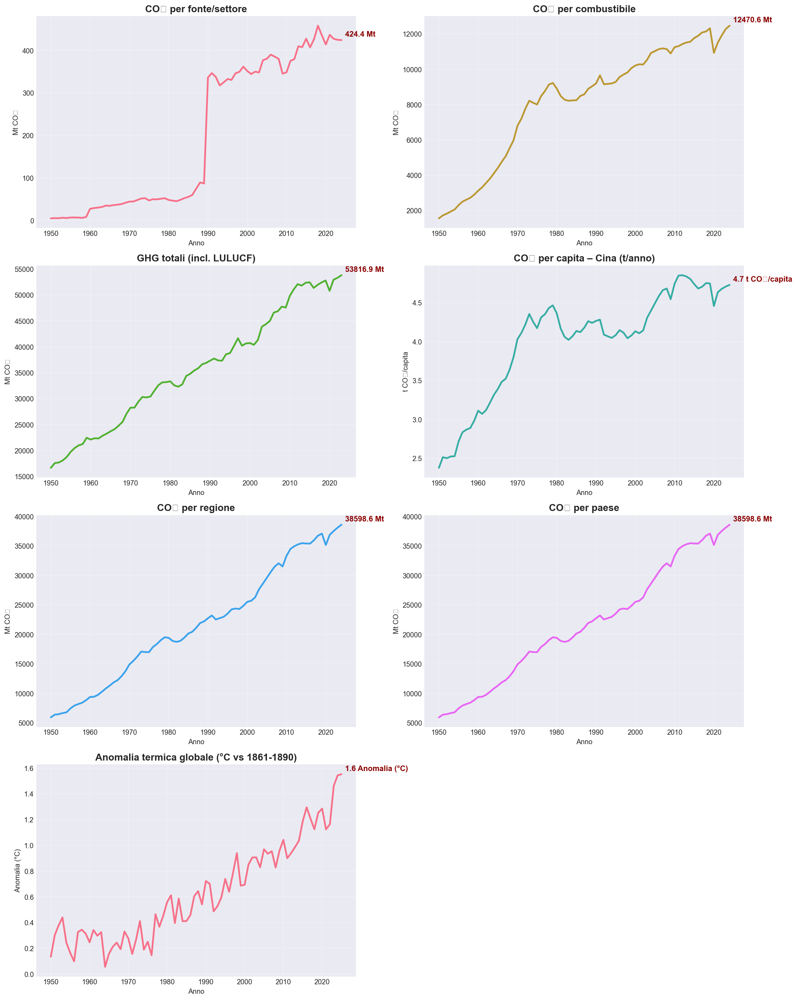
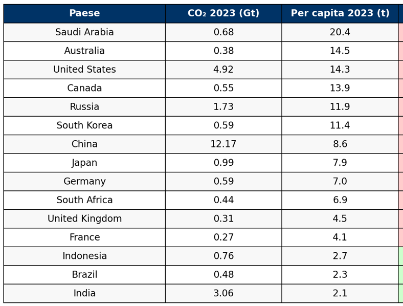

# Key Results

This folder contains the visualizations generated by the analysis scripts in `src/`.  
These images summarize the core findings of the project: historical responsibility for CO₂ emissions, climate debt, economic-emissions decoupling, temperature–emissions relationship, and equitable pathways to +1.5°C.

All figures are ready to be used in presentations, reports, policy briefs, or publications.  
Below is a step-by-step walkthrough of the main results as shown in the images.

### 1. Cumulative CO₂ Emissions by Source (1850–2024)
The stacked area charts illustrate the historical contribution of each major source to total cumulative emissions.

The version with detailed legend and final percentages clearly shows coal's long-term dominance.

Final breakdown (2024):
- Coal: 46.5% (4,067 GtCO₂)
- Oil: 33.5% (2,936 GtCO₂)
- Gas: 15.5% (1,358 GtCO₂)
- Cement, flaring and other industry: ~4.4% combined  
Total cumulative: **8,751 GtCO₂**

### 2. TCRE – Relationship between Cumulative Emissions and Global Warming
Strong linear correlation between cumulative CO₂ emissions and observed global temperature anomaly (HadCRUT5).

Key result:  
**TCRE ≈ 0.00011 °C per GtCO₂**  
**R² = 0.8995**  
In 2024: ~12,321 GtCO₂ cumulative emissions correspond to **+1.54 °C** warming relative to 1861–1890.

### 3. Historical Climate Debt (1850–2023)
Cumulative emissions normalized against per-capita fair share of the global total (~2,600 GtCO₂).

The United States accounts for the largest excess (climate debt), followed by Russia, Germany, United Kingdom, and others.  
This visualization quantifies the historical responsibility that underpins calls for climate justice and loss & damage finance.

### 4. Economic-Emissions Decoupling (1990–2023)
Two complementary views of decoupling between GDP growth and CO₂ emissions.

Full view with absolute emissions vs total GDP and detailed 2023 annotations for major economies:

Focused view on carbon intensity (kgCO₂ per $1000 of 2011 USD GDP) showing clear downward trajectories in mature economies:

Key insight: strong intensity reductions (40–60%) in EU countries, Japan, and Germany; partial and ongoing progress in China and the United States.

### 5. Multi-Trend Overview (Post-1950)
Comprehensive panel showing simultaneous trends in emissions by source, total GHG, per-capita emissions (e.g. China), and global temperature anomaly.

The acceleration since the 1980s is evident, with Asia (especially China) becoming the dominant regional driver in recent decades.

### 6. Equitable Pathways to +1.5°C (2025–2050)
Required annual reduction rates (or allowed growth) to reach net-zero by 2050 under IPCC AR6 remaining budget (~280 GtCO₂ post-2025), differentiated by current per-capita emissions and development needs.

High per-capita emitters (USA, Australia, Saudi Arabia, Canada, Russia) require aggressive reductions (~3.7% per year), while low per-capita developing countries (India, Indonesia, Brazil) are allowed limited clean growth (+2.5% per year) before peaking.

### Usage Notes
- All images are high-resolution PNG files suitable for direct inclusion in documents and slides.
- For publication-quality versions, consider exporting vector formats (SVG/PDF) by modifying the scripts.
- Always cite original sources: Global Carbon Budget 2025, HadCRUT5, IPCC AR6, Our World in Data.

These figures together tell a coherent story:  
fossil fuels (especially coal) dominate historical responsibility → warming is tightly coupled to cumulative emissions → decoupling is progressing but far too slowly → achieving +1.5°C requires strongly differentiated, equitable national efforts.

Last updated: December 2025
